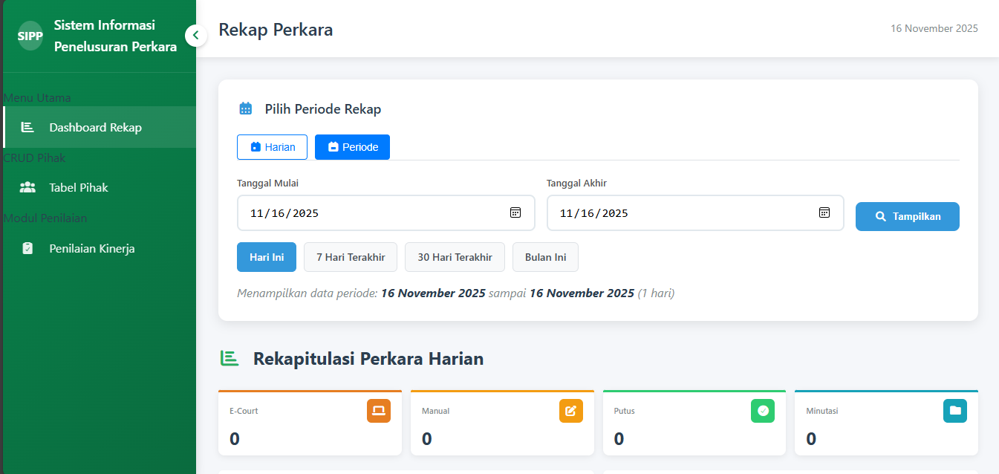
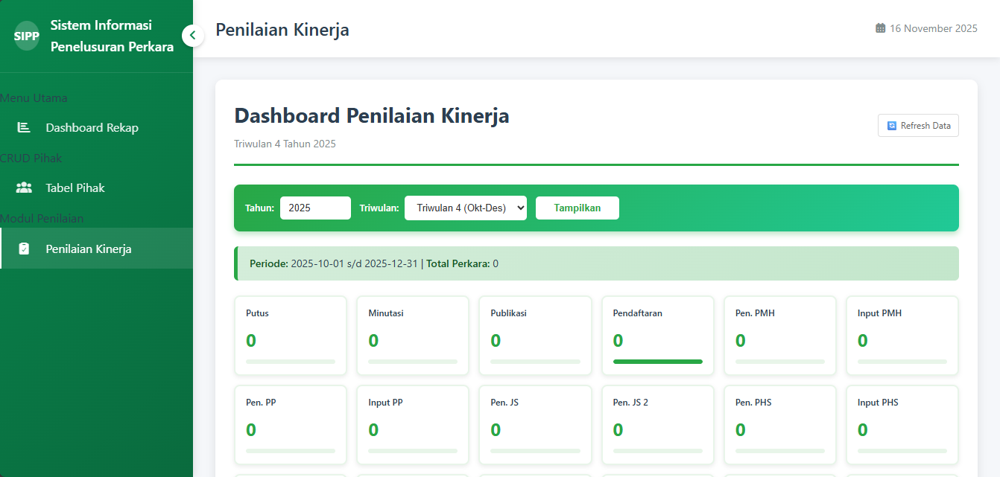
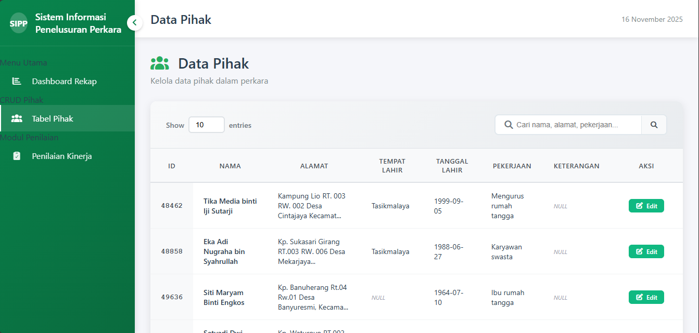

# 📊 Sistem Pengadilan Agama (SIPP)

> Sistem Informasi Penelusuran Perkara - Internal Management System


## 📋 Daftar Isi

- [Tentang Sistem](#tentang-sistem)
- [Fitur Utama](#fitur-utama)
- [Screenshots](#screenshots)
- [Requirements](#requirements)
- [Instalasi](#instalasi)
- [Struktur Project](#struktur-project)
- [API Documentation](#api-documentation)
- [Database](#database)
- [Penggunaan](#penggunaan)
- [Tech Stack](#tech-stack)
- [Troubleshooting](#troubleshooting)
- [License](#license)

---

## 🎯 Tentang Sistem

**Sistem Informasi Penelusuran Perkara (SIPP)** adalah sistem informasi internal untuk mengelola data perkara, penilaian kinerja, dan data pihak di Pengadilan Agama. Sistem ini dirancang khusus untuk **administrator** dengan fokus pada kemudahan penggunaan dan performa optimal.

### Keunggulan:
- ✅ Interface yang user-friendly
- ✅ Dashboard real-time dengan visualisasi data
- ✅ REST API untuk integrasi sistem
- ✅ Cache system untuk performa optimal
- ✅ Export data ke Excel dan PDF
- ✅ Responsive design

---

## 🚀 Fitur Utama

### 1. 📈 Dashboard Rekap Perkara
- Rekapitulasi perkara harian dan periode
- Filter berdasarkan tanggal (harian/range)
- Quick filter (Hari Ini, 7 Hari, 30 Hari, Bulan Ini)
- Statistik E-Court vs Manual
- Status perkara (Putus, Minutasi, Dalam Proses)
- Visualisasi dengan Chart.js
- Export ke Excel & PDF
- Search & filter by jenis perkara

### 2. 📊 Penilaian Kinerja
- Dashboard penilaian per triwulan
- Perhitungan otomatis nilai kinerja:
  - **Kinerja (50%)**: Putus, Minutasi, Publikasi, dll
  - **Kepatuhan (50%)**: Relaas, Mediasi, Saksi, dll
  - **Kelengkapan (10%)**: Delegasi, Petitum, BAS, dll
  - **Kesesuaian (-10%)**: Penalty untuk keterlambatan
- Detail publikasi per metrik dengan pagination
- Cache system (TTL 1 jam)
- Refresh data manual

### 3. 👥 Data Pihak
- CRUD data pihak dalam perkara
- Search & filter data
- Pagination dengan custom entries
- Validasi cross-database (SIPP & APS Badilag)
- Export data

### 4. 🔌 REST API
- 8 API endpoints lengkap
- JSON response format
- Input validation & sanitization
- Error handling yang baik
- CORS support
- Cache untuk endpoint tertentu

---

## 📸 Screenshots

### Dashboard Rekap Perkara

*Filter periode, statistik E-Court/Manual, dan detail perkara dengan visualisasi chart*

### Dashboard Penilaian Kinerja

*Metrik penilaian per triwulan dengan bobot dan nilai akhir otomatis*

### Data Pihak

*Kelola data pihak dengan search, filter, dan pagination*

---

## 💻 Requirements

### Server Requirements
- **PHP**: 5.6.40 atau lebih tinggi
- **Apache**: 2.4.37 atau lebih tinggi
- **MySQL**: 5.0 atau lebih tinggi
- **Extensions**: 
  - `mysqli` - Database connection
  - `pdo_mysql` - PDO database support
  - `mbstring` - Multibyte string support
  - `curl` - HTTP requests (optional)

### Client Requirements
- Browser modern (Chrome, Firefox, Edge, Safari)
- JavaScript enabled
- Screen resolution minimal 1280x720

### Development Tools
- **XAMPP** (recommended) - All-in-one package
- Text Editor / IDE (VS Code, Sublime, PHPStorm)
- Git (optional, untuk version control)

---

## 📦 Instalasi

### 1. Clone atau Download Project

```bash
# Clone via Git
git clone https://github.com/username/sistem-pengadilan-agama.git

# Atau download ZIP dan extract
```

### 2. Setup XAMPP

1. Install XAMPP dari [https://www.apachefriends.org](https://www.apachefriends.org)
2. Copy folder project ke `C:\xampp\htdocs\`
3. Rename folder menjadi `Sistem Pengadilan Agama1` atau sesuai keinginan

### 3. Import Database

1. Buka phpMyAdmin: `http://localhost/phpmyadmin`
2. Create database baru:
   ```sql
   CREATE DATABASE sipp CHARACTER SET utf8 COLLATE utf8_general_ci;
   CREATE DATABASE aps_badilag CHARACTER SET utf8 COLLATE utf8_general_ci;
   ```
3. Import SQL files (jika tersedia):
   - Import `sipp.sql` ke database `sipp`
   - Import `aps_badilag.sql` ke database `aps_badilag`

### 4. Konfigurasi Database

Edit file `config/config.php`:

```php
$host = 'localhost';
$username = 'root';
$password = '';  
$database = 'sipp';
$dbname_badilag = 'aps_badilag';
```

### 5. Set Permissions (jika di Linux)

```bash
chmod -R 755 assets/cache
chmod -R 755 uploads
```

### 6. Start XAMPP Services

1. Buka XAMPP Control Panel
2. Start **Apache** dan **MySQL**
3. Pastikan status **Running** dengan indikator hijau

### 7. Akses Sistem

Buka browser dan akses:
```
http://localhost/Sistem%20Pengadilan%20Agama1/
```

atau

```
http://localhost/Sistem%20Pengadilan%20Agama1/index.php
```

---

## 📁 Struktur Project

```
Sistem Pengadilan Agama1/
│
├── api/                         # REST API
│   ├── index.php                # API entry point
│   ├── routes.php               # API routing
│   ├── .htaccess                # URL rewriting
│   │
│   ├── config/                  # API config
│   │   ├── database.php         # DB wrapper
│   │   └── cors.php             # CORS settings
│   │
│   ├── helpers/                 # Helper classes
│   │   ├── response.php         # JSON response formatter
│   │   └── validator.php        # Input validation
│   │
│   └── controllers/             # API controllers
│       ├── perkaracontroller.php
│       ├── pihakcontroller.php
│       └── penilaiankinerjacontroller.php
|
├── assets/                      # Static assets
│   ├── css/                     # Stylesheets
│   ├── js/                      # JavaScript files
|   └── webfont/                 # font files
│
├── cache/                       # Cache storage (auto-generated)
|
├── config/                      # Configuration files
│   ├── config.php               # Database & main config
│   ├── functions.php            # Helper functions
│   └── cache_helper.php         # Cache management
|
├── docs/                        # Documentation
│   ├── API_DOCUMENTATION.md     # API docs
│   └── screenshots/             # Screenshots
|
├── fpdf/                        # PDF library
|
├── includes/                    # Reusable components
│   ├── header.php               # Page header
│   └── footer.php               # Page footer
│
├── penilaian_kinerja/           # Modul Penilaian Kinerja
│   ├── index.php                # Dashboard penilaian
│   ├── detail_publikasi.php     # Detail per metrik
│   └── functions/
│       └── kinerja_optimized.php # Query optimization
│
├── perkara/                     # Modul Perkara
│   ├── detail.php               # Detail perkara
│   ├── export_excel.php         # Export to Excel
│   └── export_pdf.php           # Export to PDF
│
├── pihak/                       # Modul Pihak
│   ├── index.php                # List pihak
│   ├── add.php                  # Tambah pihak
│   ├── edit.php                 # Edit pihak
│   └── delete.php               # Hapus pihak
│
├── index.php                    # Main entry point (Dashboard Rekap)
└── README.md                    # This file
```

---

## 🔌 API Documentation

Sistem ini menyediakan REST API untuk integrasi dengan sistem lain.

### Base URL
```
http://localhost/Sistem%20Pengadilan%20Agama1/api
```

### Available Endpoints

#### Perkara (3 endpoints)
- `GET /perkara/rekap` - Rekap perkara per periode
- `GET /perkara/rekap/statistik` - Statistik perkara
- `GET /perkara/detail/{id}` - Detail perkara

#### Pihak (3 endpoints)
- `GET /pihak` - List pihak (dengan pagination & search)
- `GET /pihak/{id}` - Detail pihak
- `PUT /pihak/{id}` - Update data pihak

#### Penilaian Kinerja (2 endpoints)
- `GET /penilaian-kinerja` - Data penilaian lengkap
- `GET /penilaian-kinerja/summary` - Ringkasan nilai

### Quick Example

```bash
# Get rekap perkara
curl "http://localhost/Sistem%20Pengadilan%20Agama1/api/perkara/rekap?tanggal_mulai=2024-01-01&tanggal_akhir=2024-12-31"

# Get list pihak
curl "http://localhost/Sistem%20Pengadilan%20Agama1/api/pihak?page=1&limit=10"

# Get penilaian kinerja
curl "http://localhost/Sistem%20Pengadilan%20Agama1/api/penilaian-kinerja?tahun=2024&triwulan=1"
```

📖 **[Lihat dokumentasi API lengkap](docs/API_DOCUMENTATION.md)**

---

## 🗄️ Database

### Database Schema

Sistem menggunakan 2 database:

#### 1. Database `sipp` (Main Database)
Tabel utama:
- `perkara` - Data perkara
- `perkara_putusan` - Putusan perkara
- `perkara_efiling_id` - E-filing ID
- `perkara_hakim_pn` - Data hakim
- `perkara_jadwal_sidang` - Jadwal sidang
- `perkara_mediasi` - Data mediasi
- `perkara_biaya` - Biaya perkara
- `perkara_banding_detil` - Detail banding
- `perkara_data_dukung_mediasi` - Data dukung mediasi
- `pihak` - Data pihak
- `jenis_perkara` - Master jenis perkara

#### 2. Database `aps_badilag` (External Database)
Tabel yang digunakan:
- `eac_validasi` - Validasi cross-check
- `keu_biaya` - Data biaya (cross-check)

### Relasi Antar Tabel

```
perkara (1) ----< (N) perkara_putusan
perkara (1) ----< (N) perkara_jadwal_sidang
perkara (1) ----< (N) perkara_mediasi
perkara (1) ----< (N) perkara_biaya
perkara (N) ----< (N) pihak (via perkara_pihak)
```

### Backup Database

Untuk backup database secara manual:

```sql
-- Backup via phpMyAdmin
1. Pilih database
2. Klik tab "Export"
3. Pilih "Quick" atau "Custom"
4. Klik "Go"

-- Atau via command line
mysqldump -u root -p sipp > sipp_backup.sql
mysqldump -u root -p aps_badilag > aps_badilag_backup.sql
```

---

## 📖 Penggunaan

### 1. Dashboard Rekap Perkara (Halaman Utama)

**Akses:** `http://localhost/Sistem%20Pengadilan%20Agama1/`

**Fitur:**
1. **Pilih Periode:**
   - Tab "Harian" untuk rekap per hari
   - Tab "Periode" untuk range tanggal
   - Quick buttons: Hari Ini, 7 Hari, 30 Hari, Bulan Ini

2. **Lihat Statistik:**
   - Card jenis perkara (Cerai Gugat, Cerai Talak, dll)
   - Card E-Court & Manual
   - Card Putus & Minutasi
   - Chart distribusi perkara

3. **Filter Data:**
   - Search jenis perkara via dropdown
   - Search nomor perkara / e-filing ID

4. **Export:**
   - Klik "Export ke PDF" untuk cetak
   - Klik "Export ke Excel" untuk analisa lanjut

### 2. Data Pihak

**Akses:** Menu sidebar → "Tabel Pihak"

**Fitur:**
1. **Lihat Data:**
   - Pilih jumlah entries (10, 25, 50, 100)
   - Navigasi dengan pagination

2. **Search:**
   - Ketik keyword di search box
   - Klik tombol search atau Enter
   - Reset untuk clear filter

3. **Edit Data:**
   - Klik tombol "Edit" pada row
   - Update data yang diperlukan
   - Submit untuk save

### 3. Penilaian Kinerja

**Akses:** Menu sidebar → "Penilaian Kinerja"

**Fitur:**
1. **Pilih Periode:**
   - Input tahun (YYYY)
   - Pilih triwulan (1-4)
   - Klik "Tampilkan"

2. **Lihat Dashboard:**
   - Card untuk setiap metrik penilaian
   - Summary nilai di bagian bawah
   - Tabel detail dengan bobot

3. **Refresh Data:**
   - Klik tombol "Refresh Data" di header
   - Data akan di-refresh dari database

4. **Detail Per Metrik:**
   - Klik pada card metrik
   - Lihat detail perkara untuk metrik tersebut
   - Pagination 20 data per halaman

### 4. Menggunakan API

**Test API:**

1. Buka browser atau Postman
2. Akses endpoint API:
   ```
   http://localhost/Sistem%20Pengadilan%20Agama1/api/
   ```
3. Lihat daftar endpoint available
4. Test endpoint sesuai kebutuhan

**JavaScript Example:**
```javascript
// Fetch rekap perkara
fetch('http://localhost/Sistem%20Pengadilan%20Agama1/api/perkara/rekap?tanggal_mulai=2024-01-01&tanggal_akhir=2024-12-31')
  .then(response => response.json())
  .then(data => {
    console.log('Total Perkara:', data.data.total_records);
    console.log('Data:', data.data.data);
  });
```

---

## 🛠️ Tech Stack

### Backend
- **PHP 5.6.40** - Server-side scripting
- **MySQL 5.0+** - Database management
- **Apache 2.4.37** - Web server

### Frontend
- **HTML5** - Markup
- **CSS3** - Styling
- **JavaScript (ES5)** - Client-side scripting
- **Chart.js** - Data visualization
- **Font Awesome** - Icons

### Libraries & Tools
- **PDO & MySQLi** - Database abstraction
- **FPDF** - PDF generation
- **PHPExcel** - Excel export
- **SimpleCache** - Custom cache system
- **CommonMark** - Markdown support

### Architecture
- **MVC-like Pattern** - Separation of concerns
- **REST API** - Standard HTTP methods
- **JSON** - Data interchange format
- **Responsive Design** - Mobile-friendly

---

## 🐛 Troubleshooting

### 1. Error 500 - Internal Server Error

**Penyebab:**
- PHP error tidak tertangkap
- File/folder permission salah

**Solusi:**
```php
// Aktifkan error reporting di index.php atau api/index.php
error_reporting(E_ALL);
ini_set('display_errors', 1);

// Atau cek Apache error log
C:\xampp\apache\logs\error.log
```

### 2. Database Connection Failed

**Penyebab:**
- MySQL service tidak jalan
- Kredensial database salah
- Database belum dibuat

**Solusi:**
1. Cek MySQL di XAMPP Control Panel
2. Verify credentials di `config/config.php`
3. Create database via phpMyAdmin:
   ```sql
   CREATE DATABASE sipp;
   CREATE DATABASE aps_badilag;
   ```

### 3. API Return "Resource tidak ditemukan"

**Penyebab:**
- URL salah
- `.htaccess` tidak jalan
- mod_rewrite belum aktif

**Solusi:**
1. Pastikan URL sesuai format dokumentasi
2. Enable mod_rewrite di Apache:
   - Edit `httpd.conf`
   - Uncomment: `LoadModule rewrite_module modules/mod_rewrite.so`
   - Restart Apache

### 4. Cache Tidak Ter-update

**Penyebab:**
- Cache stuck
- TTL belum expired

**Solusi:**
```php
// Force clear cache via URL
http://localhost/Sistem%20Pengadilan%20Agama1/api/penilaian-kinerja?tahun=2024&triwulan=1&clear_cache=1

// Atau manual delete cache files
C:\xampp\htdocs\Sistem Pengadilan Agama1\assets\cache\*.cache
```

### 5. Blank Page / White Screen

**Penyebab:**
- Fatal error
- Missing file

**Solusi:**
```php
// Enable error display
ini_set('display_errors', 1);
error_reporting(E_ALL);

// Check Apache error log
C:\xampp\apache\logs\error.log
```

### 6. Export PDF/Excel Tidak Jalan

**Penyebab:**
- Library FPDF tidak ditemukan
- Folder permission

**Solusi:**
1. Pastikan folder `assets/fpdf/` ada
2. Check file permissions
3. Verify include path di export files

### 7. Search/Filter Tidak Jalan

**Penyebab:**
- JavaScript error
- Query string tidak ter-encode

**Solusi:**
1. Buka Browser Console (F12)
2. Check JavaScript errors
3. Pastikan URL encoding benar

---

## 📝 Notes

### Keamanan
- ⚠️ Sistem ini dirancang untuk **internal use only** (localhost)
- ⚠️ Tidak disarankan untuk production/internet tanpa security hardening
- ⚠️ Default password database kosong (ubah untuk production)

### Performa
- ✅ Cache system aktif untuk Penilaian Kinerja (TTL 1 jam)
- ✅ Query optimized dengan prepared statements
- ✅ Pagination untuk list data besar

### Compatibility
- ✅ Tested di Chrome, Firefox, Edge
- ✅ Responsive untuk tablet & mobile
- ⚠️ PHP 5.6 adalah versi lama (EOL 2018)
- ⚠️ MySQL extension deprecated (gunakan MySQLi/PDO)

### Future Improvements
- [ ] Upgrade ke PHP 7.4+
- [ ] Implement user authentication
- [ ] Add role-based access control
- [ ] Real-time notifications
- [ ] Enhanced security features
- [ ] Unit testing
- [ ] Migration to framework (Laravel/CodeIgniter)

---

## 📄 License

This project is proprietary software developed for internal use.

**Copyright © 2025 Pengadilan Agama Tasikmalaya**

All rights reserved. This software and associated documentation files are confidential and proprietary to Pengadilan Agama Tasikmalaya.

---

## 👥 Contact

Untuk pertanyaan, bug report, atau feature request:

- **Developer:** Muhammad Ihsan
- **Email:** ihsanqolbun@gmail.com
- **Pengadilan Agama Tasikmalaya:** Singasari, Kec. Singaparna, Tasikmalaya, Jawa Barat 46412

---

## 🙏 Acknowledgments

- **XAMPP** - Development environment
- **Chart.js** - Data visualization library
- **Font Awesome** - Icon library
- **FPDF** - PDF generation library
- Dibuat oleh: Anak Magang

---

**Made with ❤️ for Pengadilan Agama Tasikmalaya**